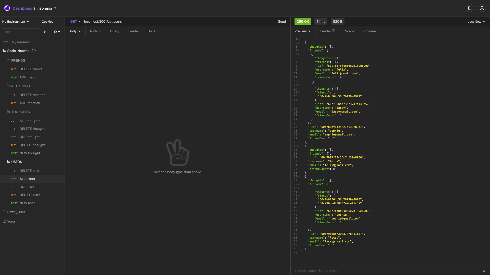
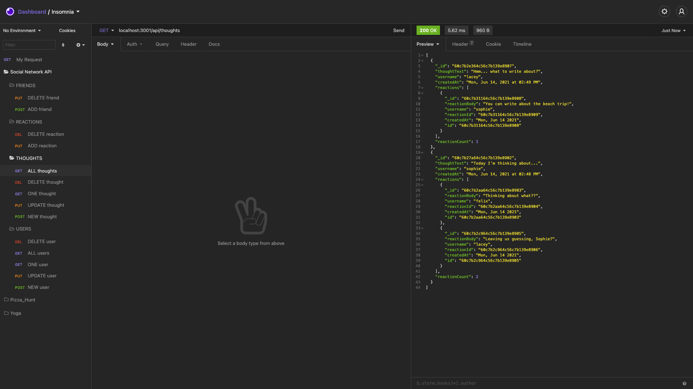

# Social Network API 

## Description
This project is the backend of an social network using MongoDB, Mongoose.js, Express.js and the npm package date-and-time.

----
## Table Of Contents
* [Installation](#installation)
* [Usage](#usage)
* [Contributions](#contributions)
* [Questions](#questions)

----
## Installation
Verify that you have your MongoDB database set up as well as a testing environment such as InsomniaCore and then clone the repository to your local machine and open your terminal. Go to the root of the cloned directory and run 'npm i express mongoose date-and-time' in the command line.

----
## Usage
To use the application, follow install instructions and then in the root of the directory run 'npm start' to start your server. You can then copy the routes from the 'routes' folder of the project and test them in InsomniaCore. You can add new users, thoughts and reactions and even add new friends to your user profile.
Click [here](https://drive.google.com/file/d/17PhBC08X3ui4H3AW9bhJjPzdIsa4Sq_I/view) to watch the walkthrough video.

----
## Contributors
[Lacey Griffith](https://github.com/lacey-griffith)

----
## Questions
If you have any questions please contact me at lacey.griffith04@gmail.com.
You can also visit my GitHub profile by clicking [here](https://github.com/lacey-griffith) and the repository for this project can be found [here](https://github.com/lacey-griffith/social_network).

----
## Screenshots

Above image shows the ability to add friends.

Above image shows the ability to post reactions to thought posts.